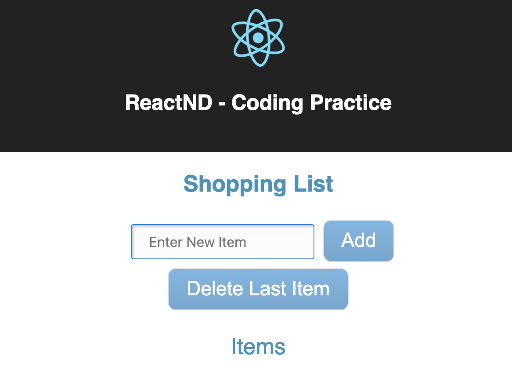
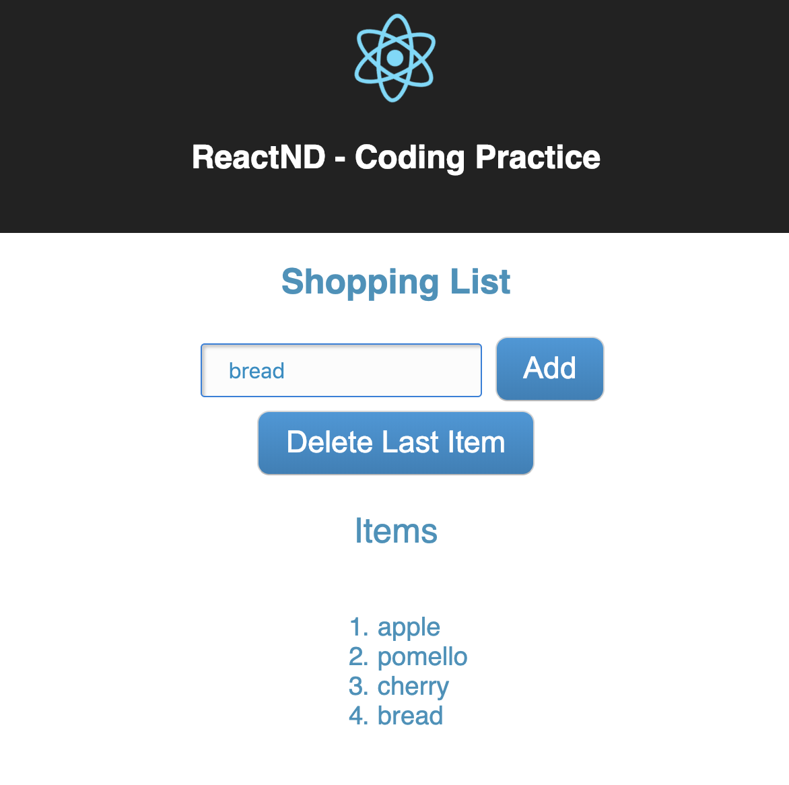

## Run Commands
`npm install` -  to get the required libraries for the project  
`npm start` - to open the project in browser 

## The Application

A shopping list with add and remove functions.

The purpose of this project is to 
 - practice passing data into components
 - creating Stateless Functional Components
 - adding state to components
 - updating state
 - creating Controlled Components
 
 
 Initial shopping list:
 
 
 
 
 Shopping list with items: 
 
 
 
 
 